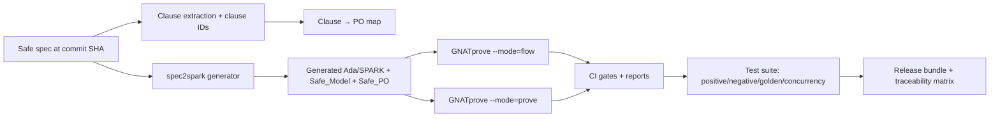

# Multi-Agent Prompt for an Annotated SPARK Companion to the Safe Language Specification

## Executive summary

Enabled connectors: GitHub.

Objective: produce a **comprehensive, traceable, tool-checkable Annotated SPARK Companion** for the Safe language specification in `berkeleynerd/safe`, suitable for language designers and implementers. The companion should turn Safe’s *normative* guarantees—especially **Bronze** (derivable flow information) and **Silver** (absence of runtime errors by construction with hard rejection when not provable)—into (a) an explicit **clause → proof-obligation (PO)** mapping and (b) generated **Ada/SPARK artifacts** (`Safe_Model` and `Safe_PO`) with contracts, ghost state, and lemma stubs. fileciteturn95file0L1-L120

This prompt is designed for a **multi-agent team**. The team will: extract spec clauses and assign stable clause IDs; generate annotated SPARK templates; define Safe AST → Ada/SPARK translation rules with conservative defaults for underspecified semantics; synthesize a CI pipeline with GNATprove flow/prove gates, assumption diffing, golden tests, and translation validation; create a test suite scaffold including positive/negative/golden/concurrency tests; and produce a traceability matrix that ties everything to **spec file paths and a commit SHA**.

Key external tool reality that the companion must respect:

- GNATprove runs **two distinct analyses**: *flow analysis* (for `Global`, `Depends`, `Initializes`, etc.) and *proof* (AoRTE + contracts). citeturn0search0  
- Concurrency proof expectations in SPARK require Ravenscar/Jorvik plus `Partition_Elaboration_Policy (Sequential)` to avoid races during elaboration. citeturn0search1turn0search3  
- Ownership reclamation for hidden/private resource types often needs explicit GNATprove ownership annotations (use sparingly; avoid turning the companion into “assume-based” verification). citeturn0search2  
- RustBelt is the right precedent for “ownership-based safety claims + library/runtime obligations”; it explicitly frames safe language cores plus verification conditions for unsafe library components. citeturn1search6turn1search47  

## Repository anchors and scope

Repo: `berkeleynerd/safe` (public). There are **no issues**, **no tests directory**, and no existing CI workflows in the repo at the time of analysis (GitHub connector search). Therefore the companion effort must include new test/CI scaffolding as first-class deliverables.

Primary spec artifacts to mine and reference:

- `spec/05-assurance.md` — defines Bronze/Silver guarantees, enumerates runtime check classes, and states the hard rejection rule. fileciteturn95file0L1-L220  
- `spec/06-conformance.md` — defines conformance levels and implementation-defined behaviors that must be handled with conservative defaults in the companion. fileciteturn95file2L1-L260  
- `spec/02-restrictions.md` — language restrictions, ownership, allocation/deallocation constraints, and D27 legality linkage. fileciteturn91file3L1-L260  
- `spec/04-tasks-and-channels.md` — task/channel semantics, deterministic `select`, and task-variable ownership (race freedom basis). fileciteturn91file2L1-L260  
- `spec/03-single-file-packages.md` — dependency interface information required for inter-unit effect summaries (critical for race freedom and ceiling priorities). fileciteturn96file3L1-L260  
- `spec/07-annex-b-impl-advice.md` — informative guidance on Ada/SPARK lowering, effect-summary generation, deallocation emission, and testing strategy. fileciteturn97file0L1-L260  
- `spec/07-annex-a-retained-library.md` — retained/excluded/modified library surface that must be reflected in the companion’s runtime model and wrappers. fileciteturn98file0L1-L260  
- `spec/08-syntax-summary.md` — authoritative grammar; the translator agent uses this as the grammar contract. fileciteturn99file0L1-L200  
- `DEFERRED-IMPL-CONTENT.md` — preserved implementation-profile ideas (GNAT/GNATprove baseline, emission idioms, concurrency profile mapping, proof gating, etc.) that should be promoted into companion tasks. fileciteturn100file0L1-L260  

Commit anchoring requirement: the team must record the **exact commit SHA** used to extract clauses and generate artifacts, and embed that SHA into file headers and clause IDs.

Provide repo-location links in code form only:

```text
repo: https://github.com/berkeleynerd/safe
example commit (recent): https://github.com/berkeleynerd/safe/commit/ce05f3d22d92e129f14b2eff6b94a9ab8a42ca4d
```

## Global constraints and artifact contract for all agents

This section is the “contract” for the multi-agent effort; violating it produces unusable outputs.

**Normative vs companion boundary**

- Treat `spec/*.md` as the normative source. The companion may add precision, but it must not silently change semantics.
- If a semantics point is underspecified or implementation-defined, do **not invent** behavior. Instead:
  1) record it as *underspecified*,
  2) choose a **conservative default** consistent with conformance rules,
  3) mark it explicitly as an assumption/parameter in the companion, and
  4) include it in the traceability matrix. fileciteturn95file2L1-L260  

**Clause ID format (mandatory)**

Every extracted clause must get a stable ID. Use a format that survives editing, supports diffing, and is machine-friendly:

- `SAFE@<commitSHA>:<path>#<section>.<subsection>.p<paragraphNumber>[:<hash8>]`

Where:
- `<commitSHA>` is the exact git commit,
- `<path>` is repo-relative (e.g., `spec/05-assurance.md`),
- `p<paragraphNumber>` uses the spec’s numbered paragraphs within that section (Safe’s spec uses numbered items heavily),
- optional `hash8` is an 8-hex content hash of the clause text for drift detection.

**PO mapping format (mandatory)**

For each clause ID, generate a PO entry with at least:

- `target`: {Bronze-flow, Silver-AoRTE, Memory-safety, Race-freedom, Determinism, Library-safety, Conformance}
- `mechanism`: {flow contract check, GNATprove proof VC, ghost model invariant, runtime wrapper check, translation validation, etc.}
- `soundness note`: what the PO guarantees and what it does *not* guarantee
- `status`: {implemented, stubbed, deferred}
- `assumptions`: explicit list; these must be diffed in CI

This aligns with Safe’s own structure: Bronze derivability, Silver check enumeration and hard rejection, and concurrency/race constraints. fileciteturn95file0L1-L260  

**Generated artifact headers (mandatory)**

Every generated file must start with a machine-readable header block:

- commit SHA
- generation timestamp
- generator version
- list of clause IDs used
- “assumption set” identifier (hash) and a pointer to `assumptions.yaml`

**Conservative defaults for underspecified semantics (mandatory)**

Defaults must be explicit and conservative. At minimum:

- Allocation failure: treat as **defined abort behavior** (do not claim Silver prevents it); record as out-of-scope for AoRTE unless spec later tightens it. fileciteturn95file0L120-L170  
- Select fairness: default is **deterministic priority by source order** with no fairness guarantees; starvation possible; do not claim liveness. fileciteturn91file2L1-L260  
- Floating-point model: default to IEEE-754 **non-trapping** semantics if required by Safe’s rules; otherwise treat FP exceptions as “implementation-defined constraint,” and surface as assumption + check in CI target profile. fileciteturn95file0L170-L240  

**Tool discipline (mandatory)**

- GNATprove’s split into flow vs proof must be reflected in CI and PO mapping; do not conflate the two. citeturn0search0  
- For concurrency, require Ravenscar or Jorvik + `Partition_Elaboration_Policy (Sequential)` in the generated Ada profile for any task/channel tests. citeturn0search1turn0search3  
- Avoid `Annotate` pragmas that introduce unchecked assumptions unless there is no alternative; if used, put them in a quarantined layer and record them as trusted in the traceability matrix. citeturn0search2  

## Agent roles and machine-actionable task list

This is the multi-agent prompt proper. Each agent must produce both human-readable deliverables and machine-actionable outputs.

### Agents and responsibilities

**Orchestrator Agent**

- **Inputs**: repo snapshot at commit SHA; outputs from all agents.
- **Outputs**: consolidated “Companion Release” folder, acceptance report, and traceability matrix.
- **Success criteria**: all required tables exist; artifact headers contain clause IDs + SHA; CI scripts wire up flow/prove + assumption diff; no missing normative clause categories.
- **Failure modes**: clause ID drift, inconsistent default assumptions, unmet traceability requirement.
- **Resources**: read-only repo access; ability to run generator locally; CI dry-run environment.

**Clause Extractor Agent**

- **Goal**: extract normative clauses and produce clause IDs + clause→PO mapping skeleton.
- **Inputs**: spec markdown files, especially assurance/conformance/syntax. fileciteturn95file0L1-L220 fileciteturn95file2L1-L260 fileciteturn99file0L1-L200  
- **Outputs**:
  - `clauses.yaml` (clause ID, text, normative flag, section headings)
  - `po_map.yaml` (initial mapping; stubs allowed but must be explicit)
  - `normative_inventory.md` (human-readable clause list)
- **Success criteria**: ≥95% of “shall” statements captured; all Silver check categories in §5.3 enumeration mapped; all implementation-defined items in conformance captured. fileciteturn95file0L240-L320 fileciteturn95file2L1-L260  
- **Failure modes**: missing clauses in tables/notes; mixing informative algorithms into normative requirements; unstable clause IDs.
- **Resources**: markdown parser; regex for numbered paragraphs; git SHA access.

**SPARK Template Agent**

- **Goal**: generate `Safe_Model` and `Safe_PO` package templates with clause-tagged stubs, contracts, ghost hooks, and lemma entry points.
- **Inputs**: `clauses.yaml`, plus D27/concurrency/ownership clauses. fileciteturn95file0L1-L260 fileciteturn91file3L1-L260 fileciteturn91file2L1-L260  
- **Outputs**:
  - `safe_model.ads/.adb` (ghost models and core invariants)
  - `safe_po.ads/.adb` (PO procedures/functions with `Pre`/`Post` and lemma stubs)
  - `po_index.md` (generated from `po_map.yaml`)
- **Success criteria**: compiles under SPARK restrictions; GNATprove can run in flow and prove modes even if some lemmas are pending; all stubs are clause-tagged.
- **Failure modes**: using non-SPARK constructs; hidden assumptions; missing clause IDs in comments.
- **Resources**: Ada toolchain + GNATprove; SPARK UG reference.

**Translator Agent**

- **Goal**: define Safe AST and translation rules to Ada/SPARK, including conservative defaults for underspecified semantics.
- **Inputs**: syntax summary + restrictions + annex B emission guidance. fileciteturn99file0L1-L200 fileciteturn91file3L1-L260 fileciteturn97file0L1-L260  
- **Outputs**:
  - `ast_schema.json` (or equivalent)
  - `translation_rules.md`
  - stub code for `spec2spark` generator
- **Success criteria**: deterministic output; handles D27 narrowing points, channel ops, and ownership moves; emits `Global/Depends/Initializes` summaries or a stable interface file as required.
- **Failure modes**: semantic drift from spec; missing proof obligations at narrowing points; nondeterministic formatting breaking golden tests.
- **Resources**: parser generator or hand parser; Ada emitter; stable pretty-printer.

**GNATprove Agent**

- **Goal**: define provability gates and “no unproved check” acceptance criteria; wire flow/prove runs.
- **Inputs**: generated Ada/SPARK, PO catalog, concurrency profile requirements. fileciteturn95file0L1-L220 fileciteturn91file2L1-L260  
- **Outputs**:
  - `gnatprove.md` (options, modes, and rationale)
  - CI step scripts (`scripts/run_gnatprove_flow.sh`, `scripts/run_gnatprove_prove.sh`)
  - `assumptions_report.txt` extraction and diffing strategy
- **Success criteria**: flow analysis passes for Bronze-target templates; proof runs generate expected VCs; assumptions are extracted and diffed. citeturn0search0  
- **Failure modes**: proofs rely on hidden assumptions; target mismatch (especially concurrency elaboration requirements); flaky CI due to prover nondeterminism.
- **Resources**: GNATprove documentation + runtime.

**CI Agent**

- **Goal**: produce reproducible CI: generate artifacts, run GNATprove flow/prove, diff assumptions, run golden tests.
- **Inputs**: `spec2spark` generator plan, GNATprove scripts, test scaffolding plan. fileciteturn97file0L1-L260 citeturn0search0  
- **Outputs**: `.github/workflows/ci.yml`, `scripts/`, caching strategy, artifact upload.
- **Success criteria**: CI is deterministic; failures are actionable; assumption diffs are highlighted.
- **Failure modes**: flaky jobs; caching hides regressions; missing provenance.
- **Resources**: GitHub Actions expertise.

**Test-Generator Agent**

- **Goal**: build test-suite scaffolding and example programs tied to clause IDs.
- **Inputs**: annex B test guidance, D27 rules, channel semantics. fileciteturn97file0L1-L260 fileciteturn95file0L240-L430  
- **Outputs**:
  - `tests/positive/`, `tests/negative/`, `tests/golden/`, `tests/concurrency/`
  - `golden/` expected Ada/SPARK output for selected tests
  - `diagnostics_golden/` expected rejection messages keyed by clause ID
- **Success criteria**: each D27 rule has ≥5 positive and ≥5 negative cases; concurrency tests cover FIFO invariants and deterministic select; negative tests assert clause-tagged diagnostics.
- **Failure modes**: tests not stable; golden outputs break due to formatting nondeterminism; missing clause tags.
- **Resources**: generator integration + diff tooling.

### Machine-actionable task list

Use the following task list format as the execution plan. Each agent must copy the tasks assigned to them into their own internal checklist and report status against task IDs.

```yaml
meta:
  repo: "berkeleynerd/safe"
  commit_sha: "<AUTO-DETECT-HEAD>"
  clause_id_scheme: "SAFE@<sha>:<path>#<sec>.p<n>[:hash8]"
  traceability_required: true

tasks:
  - id: T0
    owner: Orchestrator
    action: "Detect HEAD commit SHA; freeze it; write meta/commit.txt; require all outputs embed SHA."
    outputs: ["meta/commit.txt", "meta/generator_version.txt"]

  - id: T1
    owner: ClauseExtractor
    action: "Parse spec/*.md; extract numbered normative clauses; emit clauses.yaml + normative_inventory.md."
    outputs: ["clauses/clauses.yaml", "clauses/normative_inventory.md"]

  - id: T2
    owner: ClauseExtractor
    action: "Generate initial clause→PO map: Bronze flow, Silver AoRTE, memory safety, race freedom, determinism, conformance."
    outputs: ["clauses/po_map.yaml", "docs/po_index.md"]

  - id: T3
    owner: SPARKTemplate
    action: "Generate Safe_Model + Safe_PO templates with clause-tagged stubs for: D27 rules, ownership, channels, conformance."
    outputs: ["companion/spark/safe_model.ads", "companion/spark/safe_model.adb",
              "companion/spark/safe_po.ads", "companion/spark/safe_po.adb"]

  - id: T4
    owner: Translator
    action: "Define Safe AST schema and translation rules to Ada/SPARK; include conservative defaults for underspecified semantics."
    outputs: ["compiler/ast_schema.json", "compiler/translation_rules.md"]

  - id: T5
    owner: CI
    action: "Implement spec2spark pipeline: generate → compile → GNATprove flow/prove → diff assumptions → golden tests."
    outputs: [".github/workflows/ci.yml", "scripts/run_all.sh", "scripts/diff_assumptions.sh"]

  - id: T6
    owner: GNATprove
    action: "Define prover options, flow/prove gates, and 'assumption budget' reporting; integrate into CI scripts."
    outputs: ["docs/gnatprove_profile.md", "scripts/run_gnatprove_flow.sh", "scripts/run_gnatprove_prove.sh"]

  - id: T7
    owner: TestGenerator
    action: "Create tests: positive/negative/golden/concurrency; require clause-tagged golden diagnostics."
    outputs: ["tests/positive/", "tests/negative/", "tests/golden/", "tests/concurrency/", "tests/diagnostics_golden/"]

  - id: T8
    owner: Orchestrator
    action: "Generate traceability matrix mapping spec paths + clause IDs + SHA → generated artifacts."
    outputs: ["docs/traceability_matrix.md", "docs/traceability_matrix.csv"]

  - id: T9
    owner: Orchestrator
    action: "Assemble release bundle; verify all headers embed SHA + clause IDs; run CI locally."
    outputs: ["release/COMPANION_README.md", "release/status_report.md"]
```

## Templates, idioms, and conservative defaults

This section provides ready-to-use idioms and skeletons the agents must build upon. They are intentionally minimal but clause-tag-ready.

### SPARK package template headers with traceability

Use this standard header block in every generated `.ads/.adb` file:

```ada
-- SAFE/SPARK COMPANION (GENERATED)
-- repo: berkeleynerd/safe
-- source_commit_sha: <SHA>
-- generator: spec2spark <version>
-- generated_at_utc: <timestamp>
-- clause_ids: [SAFE@<SHA>:spec/05-assurance.md#5.3.2.p14:abcd1234, ...]
-- assumptions_set: <hash> (see companion/assumptions.yaml)
```

### `Safe_PO` skeleton: D27-style obligations (index, division, narrowing, not-null)

The assurance section explicitly enumerates Silver obligations and the hard rejection rule, which should become PO entries and GNATprove gates. fileciteturn95file0L120-L260

```ada
package Safe_PO with SPARK_Mode is

   -- Example “fact” types used by proofs-as-artifacts (ghost-friendly).
   type Range64 is record
      Lo : Long_Long_Integer;
      Hi : Long_Long_Integer;
   end record;

   function Contains (Outer, Inner : Range64) return Boolean is
     (Outer.Lo <= Inner.Lo and Outer.Hi >= Inner.Hi);

   -- PO: Division by provably nonzero divisor.
   -- clause: SAFE@<SHA>:spec/05-assurance.md#5.3.4.p21:<hash>
   function Nonzero (D : Long_Long_Integer) return Boolean is (D /= 0);

   function Safe_Div (N, D : Long_Long_Integer) return Long_Long_Integer
     with Pre  => Nonzero (D),
          Post => Safe_Div'Result = N / D;

   -- PO: Not-null dereference.
   -- clause: SAFE@<SHA>:spec/05-assurance.md#5.3.5.p23:<hash>
   type Ptr is access all Integer;        -- placeholder for model
   subtype Not_Null_Ptr is Ptr
     with Predicate => Not_Null_Ptr /= null;

   function Deref (P : Not_Null_Ptr) return Integer
     with Post => Deref'Result = P.all;

end Safe_PO;
```

### Index check idiom and the “provable index safety” bridge

Safe’s Silver story requires indexing to be provably in-bounds (by type containment or range analysis) and otherwise rejected. fileciteturn95file0L170-L220

SPARK idiom: make bounds needed for proof explicit as preconditions only in the companion model (not in Safe source), then prove that legality implies the precondition always holds.

```ada
package Safe_Model_Index with SPARK_Mode is
   type Index_T is range 0 .. 15;
   type Arr is array (Index_T) of Integer;

   function Get (A : Arr; I : Index_T) return Integer
     with Pre  => I in A'Range,     -- becomes redundant if bridged from legality
          Post => Get'Result = A(I);
end Safe_Model_Index;
```

Bridge lemma pattern (ghost or lemma procedure) should be generated from the legality/range analysis of the source program.

### Ownership move idiom and “try_send” safety

Safe’s restrictions + concurrency model extend “exclusive mutable ownership” across task boundaries by moving owning access values through channels. fileciteturn95file0L320-L370

If the channel element type includes owning pointers, the companion must choose a clear conservative rule:

- Default: **move-on-success only** for `try_send`; on failure, the sender retains ownership and the value remains valid.
- Record as an explicit semantic commitment unless the spec already states it.

Pseudo-lowering for `try_send` should preserve move discipline:

```ada
-- Lowering sketch (not normative): evaluate payload to a temp owner, attempt enqueue,
-- if success then invalidate sender’s owner (move), else keep it.

procedure Try_Send (Ch : in out Channel; X : in out Owner_T; Success : out Boolean) is
begin
   -- Success := Enqueue(Ch, X);
   -- if Success then X := Null_Owner; end if;
end Try_Send;
```

If the Safe spec treats `try_send` as taking `X` by value, the translator can still compile by creating a fresh temp and explicitly controlling ownership invalidation. The key is: failure must not silently drop resources.

(Ownership policy alignment with SPARK’s ownership model is a known sharp edge; RustBelt’s core lesson is that library/runtime components become the “unsafe extension” boundary and must have explicit verification conditions.) citeturn1search6turn1search47  

### Channel FIFO invariant idiom with ghost state

Channels are defined as bounded FIFO queues with atomic send/receive/try ops and deterministic `select` resolution. fileciteturn91file2L1-L260

Ghost-model approach:

- Ghost sequence `Q` models element order.
- Invariants: `Length(Q) <= Capacity`, FIFO property, success/failure postconditions.

```ada
package Safe_Model_Channel with SPARK_Mode is
   type Elem is private;
   Capacity : constant Positive := 8;

   -- Ghost sequence model (use a real ghost container in implementation).
   type Seq is private;

   function Len (S : Seq) return Natural with Ghost;
   function Append (S : Seq; X : Elem) return Seq with Ghost;
   function Head (S : Seq) return Elem with Ghost, Pre => Len(S) > 0;
   function Tail (S : Seq) return Seq with Ghost, Pre => Len(S) > 0;

   type Channel is private
     with Ghost,
          Type_Invariant => Len (Channel_Q (Channel)) <= Capacity;

   -- Ghost accessor (implementation-defined representation).
   function Channel_Q (C : Channel) return Seq with Ghost;

   procedure Try_Send (C : in out Channel; X : Elem; Success : out Boolean)
     with Post =>
       (if Success then Len (Channel_Q (C)) = Len (Channel_Q (C))'Old + 1
        else Len (Channel_Q (C)) = Len (Channel_Q (C))'Old);

   procedure Try_Receive (C : in out Channel; X : out Elem; Success : out Boolean)
     with Post =>
       (if Success then Len (Channel_Q (C)) = Len (Channel_Q (C))'Old - 1
        else Len (Channel_Q (C)) = Len (Channel_Q (C))'Old);

private
   type Elem is null record;
   type Seq is null record;
   type Channel is null record;
end Safe_Model_Channel;
```

This is a template: a real implementation will use SPARK-friendly ghost containers. The goal is for the agent team to build a queue abstraction whose invariants are provable in GNATprove.

### CI script template: flow/prove, assumption diffing, golden tests

GNATprove modes and the split between flow/prove are explicit and should be mirrored exactly in CI. citeturn0search0

```bash
#!/usr/bin/env bash
set -euo pipefail

SHA="$(cat meta/commit.txt)"

echo "[1/6] Generate Ada/SPARK from spec at $SHA"
./scripts/spec2spark.sh --commit "$SHA" --out companion/gen

echo "[2/6] Build (syntax/typecheck only)"
gprbuild -P companion/gen/companion.gpr

echo "[3/6] GNATprove flow (Bronze gate)"
gnatprove -P companion/gen/companion.gpr --mode=flow

echo "[4/6] GNATprove prove (Silver gate)"
gnatprove -P companion/gen/companion.gpr --mode=prove --checks-as-errors

echo "[5/6] Extract assumptions and diff"
./scripts/extract_assumptions.sh > artifacts/assumptions.new.txt
./scripts/diff_assumptions.sh artifacts/assumptions.baseline.txt artifacts/assumptions.new.txt

echo "[6/6] Golden tests: emitted Ada/SPARK and diagnostics"
./scripts/run_golden.sh
```

Assumption tracking is mandatory because SPARK/GNATprove annotation mechanisms can introduce trusted assumptions if misused (notably via certain ownership annotations). citeturn0search2  

## Traceability tables and required diagrams

All tables listed here must be produced by the agent team; the orchestrator must ensure they exist and are consistent.

### Traceability matrix seed (spec path + commit SHA → generated artifacts)

| Spec input (path) | Primary responsibility | Generated companion outputs |
|---|---|---|
| `spec/05-assurance.md` fileciteturn95file0L1-L260 | Clause Extractor + SPARK Template + GNATprove | `po_map.yaml`, `safe_po.ads/.adb`, `po_index.md`, Silver gates |
| `spec/06-conformance.md` fileciteturn95file2L1-L260 | Clause Extractor + Translator + CI | `assumptions.yaml`, `impl_defined.md`, CI target checks |
| `spec/02-restrictions.md` fileciteturn91file3L1-L260 | SPARK Template + Translator | ownership templates, deallocation emission rules |
| `spec/04-tasks-and-channels.md` fileciteturn91file2L1-L260 | Channel Agent + Translator + GNATprove | `safe_model_channel.*`, concurrency tests, profile pragmas |
| `spec/03-single-file-packages.md` fileciteturn96file3L1-L260 | Translator + Clause Extractor | dependency interface schema, effect summary rules |
| `spec/08-syntax-summary.md` fileciteturn99file0L1-L200 | Translator | parser/AST conformance tests |
| Annexes + deferred impl profile fileciteturn97file0L1-L260 fileciteturn100file0L1-L260 | Orchestrator + CI + Test Generator | test plan, CI profile, emitted-Ada conventions |

### Clause → PO mapping table (required output)

The Clause Extractor Agent must output a full table. The following is the minimum column set:

| Clause ID | Clause summary | Verification target | Mechanism | Artifact location | Assumptions |
|---|---|---|---|---|---|

Sources for targets/structure: Safe assurance/conformance and GNATprove’s flow/proof split. fileciteturn95file0L1-L260 citeturn0search0  

### Spec section → annotation type → verification target table (required output)

At minimum, include:

| Spec section | Annotation type(s) | Verification target(s) |
|---|---|---|

This table is anchored by Safe’s explicit Bronze/Silver framing and runtime check enumeration. fileciteturn95file0L1-L260  

### Prioritized annotation targets (required output)

Must rank by (severity × likelihood) for spec-tool drift and proof unsoundness. At minimum:

1) Silver check dischargeability points (narrowing, indexing, division, not-null, FP non-trapping) fileciteturn95file0L120-L320  
2) Ownership + deallocation lowering and leak checks fileciteturn91file3L1-L260  
3) Channel FIFO + `try_send`/`select` determinism and race-freedom via task-variable ownership analysis fileciteturn91file2L1-L260 fileciteturn95file0L320-L410  
4) Conformance implementation-defined surface as explicit assumptions with CI checks fileciteturn95file2L1-L260  

### CI gates table (required output)

Must include:

| Gate | Tool(s) | Pass condition | Failure artifact |
|---|---|---|---|

GNATprove gate definitions must reference the flow/prove split and concurrency requirements. citeturn0search0turn0search1  

### Mermaid diagrams (required output)

**Verification pipeline**



**Risk mapping**

```mermaid
flowchart TB
  Goal[Provability claims for Safe] --> Risk1[Spec/translator drift]
  Goal --> Risk2[Hidden assumptions in annotations]
  Goal --> Risk3[Concurrency profile mismatch]
  Goal --> Risk4[Underspecified semantics (alloc/FP/select)]
  Risk1 --> Mit1[Clause IDs + SHA in all outputs]
  Risk2 --> Mit2[Assumption diff gate + quarantine Annotate usage]
  Risk3 --> Mit3[Require Ravenscar/Jorvik + Sequential elaboration]
  Risk4 --> Mit4[Conservative defaults + explicit assumptions.yaml]
```

These mitigations align with: GNATprove’s explicit mode split, its concurrency requirements, and the known need to track assumptions when using certain annotations. citeturn0search0turn0search1turn0search2  

### Recommended formal tool assignments (required output)

The orchestrator must produce a short “tool plan” section assigning explicitly:

- GNATprove: primary flow/proof gates and AoRTE validation citeturn0search0  
- RustBelt precedent: treat runtime/library components as “unsafe extensions” with explicit verification conditions citeturn1search6turn1search47  
- Ada/AARM precedent: companion can adopt an “annotated manual” style for implementer-facing precision without changing normative spec text citeturn2search2turn2search0