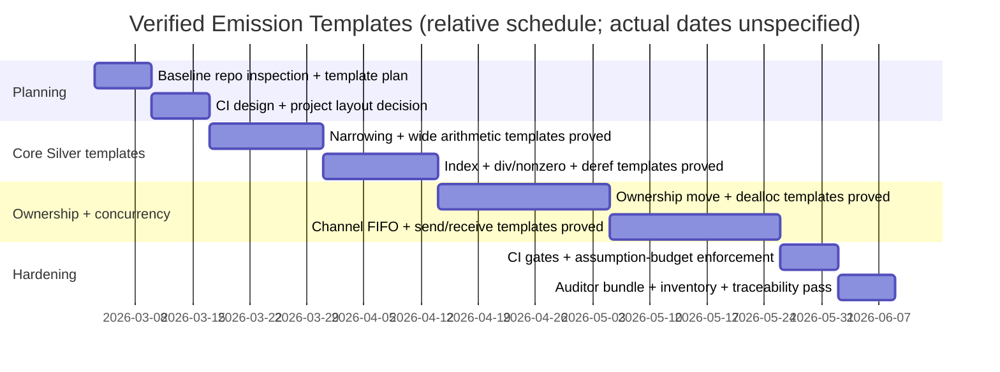

# Designing a SAFE-IMPLEMENTATION-PLAN–Style Prompt for Verified Emission Templates

## Executive summary

Enabled connectors: **github**.

Your bridge idea (contracts → verified emission templates → compiler emitter) is the right next step if you want the compiler and templates to be **SPARK Silver** verified end-to-end, because it forces you to prove the *actual emitted Ada/SPARK shapes* (protected objects, tasking pragmas, inserted assertions, deallocation patterns) rather than only the abstract companion contracts. The repo already contains the key ingredients you want the template work to reuse: a SPARK companion model (`Safe_Model`), PO “hooks” (`Safe_PO`), an assumptions ledger plus CI scripts to enforce assumption budgets, and a growing set of translation golden files that effectively define what a successful template instantiation should look like. fileciteturn150file0L1-L1 fileciteturn149file0L1-L1 fileciteturn161file2L1-L1 fileciteturn163file0L1-L1

Two practical realities constrain the prompt design:

- **Silver verification is tool-enforced**, not aspirational: in GNATprove you have to treat **unproved checks as errors** and usually treat **warnings as errors**, or “Silver” becomes “best effort.” GNATprove documents that `--checks-as-errors=on` makes unproved checks yield non-zero exit, and `--warnings=error` can also force failure. citeturn0search4turn0search11
- **Concurrency templates must be SPARK-legal**: SPARK restricts tasking/protected usage unless a Ravenscar or Jorvik profile applies, and it also requires `Partition_Elaboration_Policy (Sequential)` for such units. That has to be baked into the channel/task templates (or into a required global runtime unit that all generated code `with`s). citeturn0search5turn0search14

Finally, you asked to verify: yes—if the compiler and templates must both be SPARK Silver verified, the prompt must explicitly require (a) GNATprove Silver-grade settings and gates in CI, and (b) a template API that the compiler can use without re-opening proof gaps (i.e., no “just trust the emitter” surfaces).

## Repository baseline and relevant files

Enabled connectors are limited to entity["company","GitHub","code hosting platform"] only, and only the repository `berkeleynerd/safe` was inspected, per your constraint.

Below are the repo artifacts that are most directly relevant to emission-template work; each entry is a file path plus the reason it matters:

- `SAFE-IMPLEMENTATION-PLAN.md` — existing multi-step plan and quality gates to mirror in a “templates plan.” fileciteturn149file1L1-L1  
- `compiler/translation_rules.md` — current intended Safe→Ada/SPARK lowering rules; this is the *spec for what templates must implement*. fileciteturn151file0L1-L1  
- `compiler/ast_schema.json` — the compiler-facing AST shape; templates should cleanly map from these node kinds (e.g., ownership actions, wide-arithmetic flags) to a small template-instance dictionary. fileciteturn152file0L1-L1  
- `companion/spark/safe_model.ads` — companion abstract model contracts the templates must import/align with. fileciteturn150file0L1-L1  
- `companion/spark/safe_po.ads` and `companion/spark/safe_po.adb` — proof-obligation procedures intended to be called from emitted code; templates should be built around these hooks (not reinvent them). fileciteturn149file0L1-L1 fileciteturn149file2L1-L1  
- `docs/gnatprove_profile.md` — project-specific GNATprove policy; this must be extended so templates and the compiler are “Silver verified” under the same rules. fileciteturn149file3L1-L1  
- `companion/assumptions.yaml` — the tracked assumptions ledger; templates must not silently add assumptions (or must add them with explicit review). fileciteturn161file2L1-L1  
- `scripts/run_gnatprove_flow.sh` and `scripts/run_gnatprove_prove.sh` — existing Bronze/flow and Silver/prove runners; templates should plug into this pipeline rather than invent a new one. fileciteturn155file0L1-L1 fileciteturn156file0L1-L1  
- `scripts/extract_assumptions.sh` and `scripts/diff_assumptions.sh` — existing assumption extraction + budget gate; templates must participate (new assumptions should fail CI merges unless blessed). fileciteturn157file0L1-L1 fileciteturn158file0L1-L1  
- `.github/workflows/ci.yml` — CI wiring point; must be updated to run template proofs and assumption diff gates. fileciteturn153file2L1-L1  
- `companion/gen/companion.gpr` — the current SPARK/companion project file (Ada 2022 switches + proof switches); templates either join this project or get a sibling verified project. fileciteturn167file0L1-L1  
- `companion/gen/alire.toml` — current crate metadata; templates and/or compiler may need their own crate(s) or must integrate cleanly with the existing crate. fileciteturn168file0L1-L1  
- Goldens / tests that should become “template instantiation” test vectors:
  - `tests/positive/rule1_averaging.safe` + `tests/golden/golden_sensors.ada` (wide arithmetic + narrowing). fileciteturn163file1L1-L1 fileciteturn163file0L1-L1  
  - `tests/positive/ownership_move.safe` + `tests/golden/golden_ownership.ada` (ownership move + nulling + deallocation). fileciteturn164file2L1-L1 fileciteturn164file3L1-L1  
  - `tests/positive/channel_pipeline.safe` + `tests/golden/golden_pipeline.ada` (channels + tasks/protected objects). fileciteturn165file0L1-L1 fileciteturn166file0L1-L1  
- `SPEC-PROMPT.md` — existing “Claude Code prompt doc” style for another workstream; useful as a pattern for the new templates prompt document you want. fileciteturn169file0L1-L1  

## Literal ready-to-paste Claude Code prompt

```text
You are Claude Code working inside the repository berkeleynerd/safe.

Mission
- Implement “Verified Emission Templates” for Safe→Ada/SPARK, under SPARK 2022 rev26, such that:
  (1) each template is valid SPARK (SPARK_Mode On),
  (2) each template is GNATprove Silver verified (no unproved VCs; no warnings allowed),
  (3) templates are wired into CI with the same Bronze/flow + Silver/prove + assumptions-diff policy as the companion,
  (4) templates are designed so the future compiler emitter only instantiates/assembles them, rather than generating arbitrary SPARK.

Non-negotiable requirement
- The compiler and templates must both be SPARK “Silver verified” in the sense of GNATprove gates:
  - GNATprove must run with settings that fail the build on unproved checks and on warnings.
  - Any new proof assumptions introduced by templates must be explicitly tracked in companion/assumptions.yaml and must update the assumptions baseline in a reviewable way.

Context you must reuse (do not reinvent)
- Companion contracts and ghost models:
  - companion/spark/safe_model.ads (+ any bodies)
  - companion/spark/safe_po.ads + safe_po.adb (PO procedures/hooks)
- Translation intent:
  - compiler/translation_rules.md
  - existing tests in tests/positive and goldens in tests/golden
- Verification policy and tooling:
  - docs/gnatprove_profile.md
  - scripts/run_gnatprove_flow.sh
  - scripts/run_gnatprove_prove.sh
  - scripts/extract_assumptions.sh
  - scripts/diff_assumptions.sh
  - .github/workflows/ci.yml
  - companion/gen/companion.gpr (or create a sibling templates.gpr if editing generated files is inappropriate)
  - companion/assumptions.yaml

Outputs you must produce
Create a new templates directory and supporting infrastructure:

A) Source layout
- companion/templates/
    template_*_*.ads
    template_*_*.adb
    templates.gpr (if needed)
    README.md describing how templates are instantiated by the compiler emitter
- Each template must:
  - with/use Safe_Model and Safe_PO (as appropriate)
  - carry traceability metadata (clause IDs) in comments at top of file and at key contract points
  - expose a minimal API (public surface) that the compiler can instantiate without touching internals
  - avoid depending on arbitrary runtime packages unless explicitly permitted by the Safe target mapping

B) Proof harnesses
- For each template, include either:
  - a small “proof harness” instantiation unit (if template is generic), OR
  - a concrete stand-alone package that is itself the template (if not using generics)
- Harnesses must be part of the same GNATprove project so CI proves them.

C) CI integration
- Update CI so the following are run on templates in addition to the companion:
  1) compile (gprbuild)
  2) GNATprove flow/bronze gate
  3) GNATprove prove/silver gate
  4) extract assumptions for templates
  5) diff assumptions against a checked-in baseline
- Any failure blocks merge.

D) Traceability + audit artifacts
- Every template must map to at least one clause ID / translation rule section.
- Add/update a template inventory document:
  - docs/template_inventory.md (or similar) listing: template name, purpose, clause IDs, Safe_PO hooks used, proof status, and tests/goldens covered.

Constraints and quality bars
1) SPARK 2022 rev26 target
- Keep code within SPARK 2022 restrictions.
- For any concurrency constructs (tasks/protected objects), ensure SPARK legality by requiring an applicable profile (Ravenscar or Jorvik) and Partition_Elaboration_Policy (Sequential) at the appropriate compilation unit scope. If you centralize these pragmas in a runtime package, that package must be imported by any concurrency template output.

2) GNATprove settings (Silver-grade)
- Configure GNATprove via project attribute Proof_Switches (preferred) or command line.
- Must fail on:
  - unproved checks (checks-as-errors)
  - warnings (warnings=error)
- Choose a proof level and prover set consistent with project norms (start with level=2 unless repo policy dictates otherwise).
- Run both flow (bronze) and prove (silver).

3) Assumption governance
- Do not introduce new assumptions casually.
- If a proof needs an assumption:
  - record it in companion/assumptions.yaml with an ID, severity, rationale, scope, and the template(s) affected
  - update the assumptions baseline artifact that CI diffs against
  - add an “Assumption Justification” paragraph to the template’s header comment

4) Template API discipline
- Compiler instantiation should be a simple, typed mapping (names, types, capacities), not “emit arbitrary code.”
- Prefer small, orthogonal templates:
  - one for narrowing checks,
  - one for ownership move patterns,
  - one for channel buffer implementation and send/receive operations,
  - etc.
- Each template must declare exactly what inputs it needs (types, bounds, constants) and what it guarantees.

Work plan you must follow (deliver milestone artifacts at each checkpoint)
Milestone 0: Baseline + design review packet
- Read the repo files listed above.
- Produce docs/template_plan.md containing:
  - target directory layout,
  - proposed template list in priority order,
  - per-template: required Safe_PO hooks, clause IDs, expected golden coverage, proof strategy,
  - CI changes needed and how they align with existing pipeline.
- Include a “Reviewer Packet” section: list exactly which files a 1M-context reviewer must read and which commands/logs to inspect.

Milestone 1: Arithmetic + narrowing templates (first proofs)
- Implement and prove:
  - wide intermediate arithmetic handling at narrowing points (assignment + return first)
  - division-by-nonzero checks as needed to support the arithmetic goldens
- Demonstrate by matching (or intentionally updating) tests/golden/golden_sensors.ada.
- Provide:
  - GNATprove logs (or summarized gnatprove.out) showing 0 unproved checks.
  - assumptions diff output showing no unreviewed assumption changes.

Milestone 2: Ownership templates
- Implement and prove ownership move + scope-exit deallocation patterns needed for golden_ownership.ada.
- Demonstrate with tests/positive/ownership_move.safe and tests/golden/golden_ownership.ada.

Milestone 3: Channel + concurrency templates
- Implement and prove channel backing (protected object FIFO) + send/receive + capacity checks.
- Ensure SPARK legality for tasking/protected usage (profile + partition elaboration policy).
- Demonstrate with tests/positive/channel_pipeline.safe and tests/golden/golden_pipeline.ada.

Milestone 4: CI hardening + auditor-ready artifacts
- Ensure templates are fully integrated into CI.
- Add/update docs/template_inventory.md.
- Provide a final “Audit Bundle” document:
  - list of templates, proof status, assumptions used, clause IDs, tests/goldens covered
  - exact commands to reproduce proofs locally (including alr/gpr steps)
  - expected outputs and where to find them

Implementation instructions
- Make small commits per template or per milestone.
- When tests/goldens mismatch, do not handwave:
  - either fix template to meet the existing golden, or
  - update the golden with a written justification + clause/translation-rule reference.
- Keep public API minimal and stable, because it becomes the compiler emitter API later.

Exit criteria (when you are “done”)
- All templates in the prioritized list for this phase:
  - compile with Ada 2022 switches
  - pass GNATprove flow and prove with strict failure settings
  - are covered by at least one instantiation test and/or golden diff
  - are traceable to clause IDs and translation rule sections
- CI runs all relevant steps and fails correctly on regressions.

Now begin by:
1) creating docs/template_plan.md and docs/template_inventory.md (stub),
2) creating companion/templates/ with a first template skeleton and its proof harness,
3) updating the project/CI so the skeleton is built and proved.
```

Why this prompt is shaped this way: it explicitly (a) forces reuse of `Safe_Model`/`Safe_PO` rather than introducing parallel/competing contracts, fileciteturn150file0L1-L1 fileciteturn149file0L1-L1 (b) encodes Silver as a CI-enforced gate rather than a label, citeturn0search4turn0search11 and (c) forces concurrency legality decisions up front, because channel templates otherwise fail SPARK legality. citeturn0search5turn0search14

## Revised prompt document in repo root

You referenced an existing repo-root document named something like **“Designing a SAFE-IMPLEMENTATION-PLAN–Style Prompt…”**. In the current repo snapshot, there is no file by that title; the closest repo-root analogue is `SPEC-PROMPT.md`, which is a “Claude Code prompt doc” but for spec drafting, not emission templates. fileciteturn169file0L1-L1

So, instead of a diff, here is a **new repo-root document** you should add (proposed filename: `TEMPLATES-PROMPT.md`). It is already aligned with **SPARK 2022 rev26** constraints as far as public tooling permits; note that I did not find a publicly labeled “rev26” document, so this aligns to current entity["company","AdaCore","Ada/SPARK toolchain vendor"] GNATprove/SPARK documentation behavior and names. citeturn1search12turn1search5

**Proposed new file: `TEMPLATES-PROMPT.md` (full content)**

```markdown
# Verified Emission Templates — Claude Code Prompt

## Purpose

This prompt guides an LLM agent to design, implement, and GNATprove a suite of
Verified Emission Templates for Safe→Ada/SPARK.

Goal: bridge from proved companion-model contracts to a future compiler emitter by
proving the concrete SPARK code shapes the emitter will instantiate.

## Hard requirements

- SPARK 2022 (rev26) target: template code must be SPARK-legal.
- Silver verification required:
  - GNATprove must fail the build on any unproved checks and on warnings.
- Assumption governance:
  - Any proof assumptions introduced by templates must be explicitly tracked and reviewed.

## Inputs (must read)

- SAFE-IMPLEMENTATION-PLAN.md
- compiler/translation_rules.md
- companion/spark/safe_model.ads
- companion/spark/safe_po.ads + safe_po.adb
- docs/gnatprove_profile.md
- companion/assumptions.yaml
- scripts/run_gnatprove_flow.sh, scripts/run_gnatprove_prove.sh
- scripts/extract_assumptions.sh, scripts/diff_assumptions.sh
- tests/positive/* and tests/golden/*
- .github/workflows/ci.yml

## Output structure

Create:
- companion/templates/
  - template_*.ads/.adb (and harnesses)
  - templates.gpr if separating from generated companion/gen/companion.gpr
  - README.md describing instantiation contract for the compiler emitter
- docs/template_plan.md
- docs/template_inventory.md

## Template rules

Each template:
- imports Safe_Model and Safe_PO as appropriate.
- documents applicable clause IDs and translation-rule sections at file header.
- provides a minimal public API.
- keeps proof assumptions explicit and referenced.
- is covered by at least one instantiation test plus a golden diff or equivalence check.

## CI rules

CI must run on templates:
- compile
- GNATprove flow (bronze)
- GNATprove prove (silver)
- extract assumptions
- diff assumptions vs baseline

Any failure blocks merge.

## Milestones and audit artifacts

At each milestone, produce:
- a reviewer packet listing files changed
- exact commands to reproduce proofs
- GNATprove output summaries
- assumption diff output
- a mapping of templates to clause IDs and tests

## Start steps

1) Write docs/template_plan.md (design + prioritized backlog).
2) Add a first template skeleton + harness under companion/templates/.
3) Wire templates into CI; ensure skeleton compiles, passes flow and (trivial) proof.
```

## Template backlog and prioritization

The table below is intentionally biased toward templates that (a) unlock the Silver story early, and (b) correspond to existing goldens so you can validate “template instantiation output” by diffing against known-good Ada. fileciteturn163file0L1-L1 fileciteturn164file3L1-L1 fileciteturn166file0L1-L1

| Template name | Rationale | Required companion PO hooks | Example test / golden | Estimated effort |
|---|---|---|---|---|
| Narrowing: assignment + return | Central to D27 Rule 1; touches most generated code; easiest to validate with an existing golden | `Safe_PO.Narrow_Assignment`, `Safe_PO.Narrow_Return` (and `Safe_Model.Range64` support) fileciteturn149file0L1-L1 fileciteturn150file0L1-L1 | `tests/positive/rule1_averaging.safe` → `tests/golden/golden_sensors.ada` fileciteturn163file1L1-L1 fileciteturn163file0L1-L1 | Medium |
| Wide-arithmetic loop accumulator micro-pattern | Encodes the “emit assertions about range while iterating” pattern; makes Silver proof robust | Same as above + any “safe div” helper used inside accumulators fileciteturn149file0L1-L1 | Same as above | Medium |
| Division / mod / rem “provably nonzero” pattern | Rule 3 is fragile in practice; better to prove a single emission shape than rediscover all the time | `Safe_PO.Safe_Div`, `Safe_PO.Nonzero`, `Safe_PO.Safe_Mod`, `Safe_PO.Safe_Rem` (as implemented) fileciteturn149file0L1-L1 | `tests/positive/channel_pipeline.safe` (division by literal) and Rule 3 tests (non-golden) fileciteturn165file0L1-L1 | Small–Medium |
| Index safety: indexing + narrowing-conversion pattern | Rule 2 template: safe indexing construct; prevents “oops integer index” regressions | `Safe_PO.Safe_Index`, `Safe_PO.Narrow_Indexing` fileciteturn149file0L1-L1 | Rule 2 tests (e.g., `rule2_*`) + diagnostics goldens (non-Ada goldens) | Medium |
| Not-null dereference guard | Rule 4; should be a standard pre-deref assert + not-null subtype conversion pattern | `Safe_PO.Not_Null_Ptr`, `Safe_PO.Safe_Deref` (as available) fileciteturn149file0L1-L1 | Rule 4 tests (e.g., `rule4_*`) | Small–Medium |
| Ownership move assignment | This is where “templates vs. arbitrary emitter” matters most; the pattern is subtle (null-before-move, null source after move) | `Safe_PO.Check_Owned_For_Move`, `Safe_PO.Check_Not_Moved` + any ownership-state model helpers fileciteturn149file0L1-L1 fileciteturn150file0L1-L1 | `tests/positive/ownership_move.safe` → `tests/golden/golden_ownership.ada` fileciteturn164file2L1-L1 fileciteturn164file3L1-L1 | Medium–Large |
| Scope-exit auto-deallocation ordering | Needs to be standardized and proved once; otherwise every generated scope becomes a proof minefield | Ownership-related hooks + any “dealloc guard” helper used | Same golden as above | Medium |
| Channel FIFO backing (protected object) + send/receive | High payoff; but concurrency brings SPARK legality constraints (profile + partition elaboration policy), so do later once proof pipeline is steady | `Safe_PO.Check_Channel_Capacity_Positive`, `Check_Channel_Not_Full`, `Check_Channel_Not_Empty` + `Safe_Model.Channel_State` as needed fileciteturn149file0L1-L1 fileciteturn150file0L1-L1 | `tests/positive/channel_pipeline.safe` → `tests/golden/golden_pipeline.ada` fileciteturn165file0L1-L1 fileciteturn166file0L1-L1 | Large |
| Channel try_send / try_receive | Usually straightforward once FIFO base exists; still needs deterministic contracts | Same channel hooks + “success flag” contract shape | `tests/concurrency/try_send_ownership.safe` (if present) | Medium |
| Select lowering (polling + delay) | Deterministic select is tricky; should be proven by a dedicated template and then reused | Likely channel hooks + timing semantics policy | select tests (e.g., `select_priority.safe`) | Large |

“Estimated effort” is intentionally not in calendar days because team size and calendar dates are unspecified; treat it as relative complexity for a small engineering team.

## Milestone plan and audit artifacts

Team size: **unspecified**. Calendar dates: **unspecified** (timeline uses relative weeks from kickoff).

Key GNATprove facts to bake into the milestones:

- GNATprove modes include `flow` (aka `bronze`) and `prove`; `all` runs both, and “silver” is a recognized mode name in GNATprove’s mode set. citeturn1search5turn0search4  
- Project configuration should use the project `Prove` package attribute `Proof_Switches`. citeturn1search0  
- Fail builds on unproved checks and warnings (`--checks-as-errors=on`, `--warnings=error`). citeturn0search4turn0search11  

Mermaid timeline (relative; adjust durations as reality dictates):



Milestones, deliverables, and what a 1M-context reviewer needs:

- **Milestone: Template plan locked**
  - Deliverables: `docs/template_plan.md`, initial `docs/template_inventory.md`, decision on whether templates live in the generated companion project or a sibling `templates.gpr`. fileciteturn167file0L1-L1
  - Auditor artifacts: plan doc, file list of touched build/CI files, mapping from translation rule sections to planned templates. fileciteturn151file0L1-L1

- **Milestone: First Silver-proved templates (arithmetic/narrowing)**
  - Deliverables: at least one narrowing template + harness, GNATprove flow+prove clean, and a golden-diff demonstration against `golden_sensors.ada`. fileciteturn163file0L1-L1
  - Auditor artifacts: GNATprove report outputs, proof switches used, “no unproved checks” evidence, and assumptions diff output that is unchanged (or explicitly justified). fileciteturn157file0L1-L1 fileciteturn158file0L1-L1

- **Milestone: Ownership templates**
  - Deliverables: move + deallocation templates proven; golden match for `golden_ownership.ada`. fileciteturn164file3L1-L1
  - Auditor artifacts: evidence that move semantics uses the same Safe_PO hooks everywhere; no ad-hoc variations.

- **Milestone: Channel/concurrency templates**
  - Deliverables: protected-object FIFO + send/receive templates proven; golden match for `golden_pipeline.ada`. fileciteturn166file0L1-L1
  - Auditor artifacts: explicit SPARK legality mechanism for tasking/protected constructs (profile + sequential partition elaboration policy) and proof evidence. citeturn0search5turn0search14

- **Milestone: Audit-ready release**
  - Deliverables: templates inventory complete, CI gates enforced, assumptions baseline updated only if reviewed, and a single “Audit Bundle” doc listing how to reproduce proofs. citeturn1search0turn1search8  
  - Auditor artifacts: a deterministic command transcript; if sessions are checked in, include GNATprove replay guidance (optional but useful). citeturn1search8

## CI integration checklist and GNATprove profile settings

Two key points from GNATprove documentation govern CI correctness:

- Use `Proof_Switches` in the project file to define GNATprove switches at project scope (and file-specific if needed). citeturn1search0  
- Ensure CI fails on unproved checks via `--checks-as-errors=on`, and on warnings via `--warnings=error`. citeturn0search4turn0search11

Also relevant for teams: GNATprove sessions can be shared and replayed, but you don’t have to adopt that immediately; it’s an optional accelerator once proofs stabilize. citeturn1search8

### CI checklist

| Item | Why it exists | Enforcement mechanism |
|---|---|---|
| Build templates with Ada 2022 switches | Keep emitter output consistent with repo baseline (Ada 2022) | `gprbuild -P …` as CI step (either extend existing or add sibling project) |
| GNATprove flow (Bronze) gate | Prevent flow/initialization issues; needed for soundness | `gnatprove --mode=flow` (or `--mode=bronze`) citeturn1search5 |
| GNATprove prove (Silver) gate | Prove AoRTE + contracts for templates | `gnatprove --mode=prove --level=<n>` (or `--mode=silver` if you choose `all`) citeturn1search5 |
| Fail CI on unproved checks | “Silver verified” must be strict | `--checks-as-errors=on` citeturn0search11 |
| Fail CI on warnings | Prevent “warning drift” and latent proof fragility | `--warnings=error` citeturn0search4turn0search11 |
| Assumption extraction | Track proof assumptions as an explicit budget | Run `scripts/extract_assumptions.sh` fileciteturn157file0L1-L1 |
| Assumption diff against baseline | Force review for new assumptions | Run `scripts/diff_assumptions.sh` fileciteturn158file0L1-L1 |
| Golden diff tests | Make templates “real” by matching known output shapes | Diff generated instantiation output vs `tests/golden/*.ada` fileciteturn163file0L1-L1 fileciteturn166file0L1-L1 |
| Concurrency legality guard | Templates that use tasks/protected must be SPARK-legal | Require Ravenscar/Jorvik + `Partition_Elaboration_Policy(Sequential)` in the relevant units citeturn0search5turn0search14 |

### Suggested GNATprove profile switches

Use project file configuration (preferred) because GNATprove supports `Proof_Switches` in the project `Prove` package. citeturn1search0

Example project snippet (templates.gpr or merged into a non-generated wrapper .gpr):

```ada
project Templates is
   for Source_Dirs use ("./", "../companion/spark");
   for Object_Dir use "obj/";

   package Prove is
      for Proof_Switches ("Ada") use (
         "-j0",
         "--mode=all",
         "--level=2",
         "--checks-as-errors=on",
         "--warnings=error",
         "--report=all",
         "--counterexamples=off"
      );
   end Prove;
end Templates;
```

Notes:
- `--mode=all` runs both flow and proof in one invocation; GNATprove documents modes and aliases (`bronze`, `silver`). Pick either split steps (flow then prove) or all-in-one, but keep gates strict. citeturn1search5turn0search4  
- Level choice: GNATprove defines `--level` as a preset bundle of prover/timeouts; level 2 is a common “strong enough but not absurd” default. citeturn1search5  
- If you prefer explicit provers/timeouts, use those switches instead (AdaCore docs show typical patterns). citeturn1search4turn1search7

### Sample command line (for local reproduction)

GNATprove standard invocation is `gnatprove -P <project-file>`, with `--mode` selecting flow/prove/all and `-u` optionally restricting units. citeturn0search4

Example:

```sh
gnatprove -P companion/templates/templates.gpr --mode=all --level=2 \
  --checks-as-errors=on --warnings=error --report=all
```

### Alire packaging notes

If you make templates a separate crate or need GNATprove as a tool dependency, Alire supports adding GNATprove as a dependency (`alr with gnatprove`) and manages build environment via `alire.toml`. citeturn0search3turn0search6

## Risks and gating criteria

### Risk register

| Risk | What it breaks | Likely cause | Mitigation |
|---|---|---|---|
| Proof fragility / solver sensitivity | CI becomes flaky; “Silver verified” credibility erodes | overfitted assertions, unstable prover heuristics | Standardize proof style per template; prefer simple assertions + helper lemmas; pin proof switches; consider `--counterexamples=off` for determinism citeturn1search5 |
| Assumption creep | You “prove” everything by assuming it | templates quietly introduce assumptions beyond ledger | Enforce assumption diff gate; require explicit assumption IDs + rationale in headers fileciteturn158file0L1-L1 |
| Concurrency legality failure | Channel templates fail SPARK legality | missing Ravenscar/Jorvik profile or partition elaboration policy | Build a single “runtime policy” unit or enforce pragmas in each concurrency template citeturn0search5turn0search14 |
| Template API too large/unstable | Compiler emitter planning stalls | templates expose too much surface area, causing churn | Enforce “minimal API” rule; hide internals; document required substitution parameters clearly |
| Divergence from translation_rules.md | Templates aren’t actually what the compiler intends | ad-hoc fixes to pass proof | Gate every template change with a translation-rule reference + golden or test justification fileciteturn151file0L1-L1 |
| CI runtime explosion | Slow proofs block iteration | too-high proof levels, too many provers | Start at level=2; use file-specific Proof_Switches only where needed (supported by GNATprove) citeturn1search0 |

### Gating criteria to move from templates to compiler emitter planning

You should not move to “compiler emitter planning” until these are true:

1. **Template suite coverage (phase-1 complete):** At minimum, you have Silver-proved templates for narrowing, indexing, division-nonzero, not-null deref, ownership move+cleanup, and channel send/receive (or a documented deferral of concurrency templates with explicit justification). fileciteturn151file0L1-L1  
2. **CI enforces Silver strictly:** GNATprove runs fail on unproved checks and warnings for templates and for compiler code, consistently. citeturn0search4turn0search11  
3. **Assumption budget is stable:** assumption diffs are empty for steady-state runs; any new assumption is recorded, reviewed, and justified. fileciteturn161file2L1-L1  
4. **Golden-backed instantiation tests exist:** at least the existing goldens (`golden_sensors.ada`, `golden_ownership.ada`, `golden_pipeline.ada`) can be reproduced via “instantiate templates” rather than ad-hoc emission. fileciteturn163file0L1-L1 fileciteturn164file3L1-L1 fileciteturn166file0L1-L1  
5. **Template API contract is documented and frozen:** the emitter-facing interface (what parameters are needed to instantiate each template) is stable enough to plan the compiler emitter as a deterministic assembler rather than a code generator.

If those gates are met, compiler implementation planning becomes a mechanical exercise: map AST node kinds and analysis flags to *template instances + wiring* (package/unit assembly), and prove the emitter itself as a pure “assembler” in SPARK Silver terms. fileciteturn152file0L1-L1